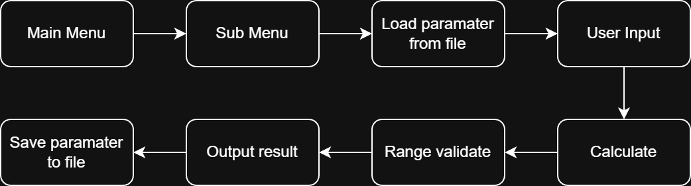

# DC-DC Converter Calculator


A interactive C command-line tool designed for Power Electronics engineers and students. It assists in calculating parameters for **Buck** and **Boost** converters in both **CCM** (Continuous Conduction Mode) and **DCM** (Discontinuous Conduction Mode).

**Workflow:**



## Installation & Build

<details open>
<summary>Install</summary>

1. Clone the repository
```bash
git clone https://github.com/ELEC2645/unit-2-project-template-AllogeneSSRD

# Navigate to the cloned directory
cd unit-2-project-template-AllogeneSSRD
```
2. Compile the program

```bash
# Windows
gcc main.c funcs.c -o main.exe -lm

# Linux (Github Codespaces)
gcc main.c funcs.c -o main.out -lm

# the -lm at the end links the math library
```

</details>

<details open>
<summary>Run</summary>

```bash
# Windows
.\main.exe

# Linux (Github Codespaces)
./main.out
```

</details>


## Usage Examples

### 1. Main Menu
Main menu will show upon launching, select your converter topology and operating mode:


```bash
----------- Main menu -----------

        1. Buck Converter - CCM
        2. Buck Converter - DCM
        3. Boost Converter - CCM
        4. Boost Converter - DCM
        5. Exit

-----------------------------------
```

### 2. Sub Menu
Sub menu displays the formulas available for each mode.

| CCM (Buck & Boost)   | DCM (Buck & Boost)   |
| -------------------- | -------------------- |
| Duty cycle           | Duty cycle           |
| Inductor & I ripple  | Boundary constant Vi |
| Capacitor & V ripple | Boundary constant Vo |
| Back to main         | Back to main         |

**Example:** Buck Converter - CCM mode

Duty Cycle: $K = \frac{V_o}{V_i}$

Current Ripple: $\Delta i = \frac{(1-K)\cdot V_o}{f_s\cdot L}$

Voltage Ripple: $\Delta v_o = \frac{(1-K)\cdot V_o}{8{f_s}^2 \cdot C \cdot L}$


```bash
---------- Buck Converter - CCM ----------

        Choice a formula to calculate.
        1. Duty cycle K
        2. Inductor & Current Ripple
        3. Capacitor & Voltage Ripple
        4. Back to Main Menu
        5. Exit

--------------------------------------------
```

### 3. Calculation

The tool allows you to calculate any variable in a formula by entering `?`.

**Example:** Calculating Input Voltage ($V_i$) for a Buck Converter.

```bash
>> Buck Converter - CCM Mode
Formula (Duty cycle): K = Vo / Vi
Variables: Vo (Output Voltage), Vi (Input Voltage), K (Duty Cycle)
Provide any two values to calculate the other.
Enter '?' for the unknown variable.

Please enter value of Output Voltage (Vo: V): 15
Please enter value of Input Voltage (Vi: V): ?
Please enter value of Duty Cycle (K): 0.2

Calculated Input Voltage (Vi = Vo / K): 75.0000 V
```

#### Reuse parameters:
After the first use. You can also type `r` to reuse stored values from a previous session.

```bash
>> Buck Converter - CCM Mode
Formula (Duty cycle): K = Vo / Vi
Variables: Vo (Output Voltage), Vi (Input Voltage), K (Duty Cycle)
Provide any 2 values to calculate the other.
Enter '?' for the unknown variable.

Please enter value of Output Voltage (Vo: V)
Or use stored value (15.0000) by 'r': ?

Please enter value of Input Voltage (Vi: V)
Or use stored value (75.0000) by 'r': r
Input Voltage (Vi: V) read from file: 75.0000

Please enter value of Duty Cycle (K)
Or use stored value (0.2000) by 'r': 0.3
Calculated Output Voltage (Vo = K * Vi): Vo = 22.5000 V
```

#### Range validation:

When the result is out of expected range. The tool will highlights it with a warning.

```bash
>> Buck Converter - CCM Mode
Formula (Duty cycle): K = Vo / Vi
Variables: Vo (Output Voltage), Vi (Input Voltage), K (Duty Cycle)
Provide any 2 values to calculate the other.
Enter '?' for the unknown variable.

Please enter value of Output Voltage (Vo: V): 5

Please enter value of Input Voltage (Vi: V): 2

Please enter value of Duty Cycle (K): ?
Warning: result is out of the expected range (0.00 to 1.00).
Calculated Duty Cycle (K = Vo / Vi): K = 2.5000  (Out of range: 0,1)
```


## 📄 License

This project is licensed under the [Apache License](LICENSE)

Copyright © 2025 [University of Leeds](https://www.leeds.ac.uk/)

Licensed under the Apache License, Version 2.0
